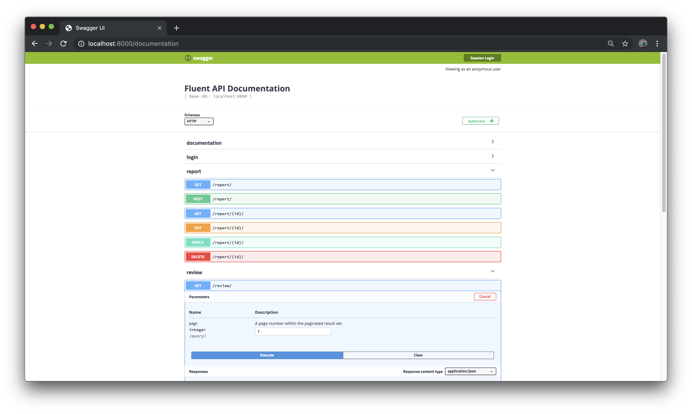

# Fluent Back-End

# Installation

## First time run
```
pipenv shell
pipenv install
python manage.py migrate
```

## Run
```shell
pipenv shell
python manage.py runserver
```

## Testing
```
pipenv shell
python manage.py test
```

# Database Management

## Open SQLite CLI
```
python manage.py dbshell
```

## Check list of tables
```
sqlite> .tables
```


# API Documentation

### localhost:8000/documentation
